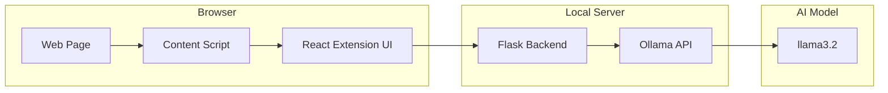
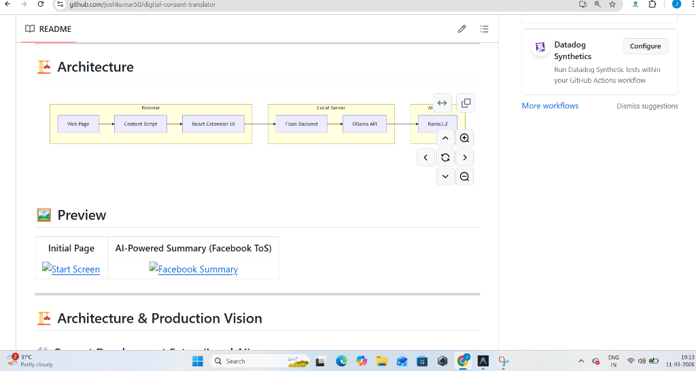
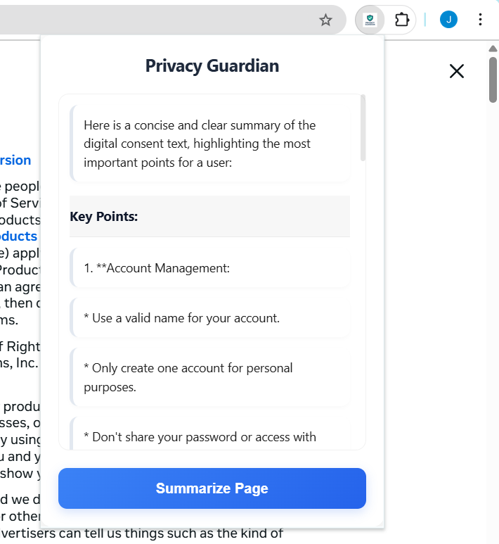

# 🛡️ Privacy Guardian (Digital Consent Translator)

**Privacy Guardian** is a privacy-first browser extension designed to protect users from the overwhelming complexity of digital consent forms and Terms of Service (ToS). It uses local AI to "translate" long, legalese-heavy documents into concise, actionable summaries instantly.

## 🎯 The Problem
Modern websites use long legal documents designed to be difficult to read. Typical ToS pages contain:
- **Thousands of words** of dense text.
- **Complex legal terminology** that confuses users.
- **Hidden clauses** about data usage and rights.

Because of this, most users click **"Accept"** without reading, unknowingly giving away their personal data or rights.

## 💡 The Solution
Privacy Guardian levels the playing field by automatically:
1.  **Detecting** legal text on any webpage.
2.  **Extracting** only the relevant, high-impact content.
3.  **Processing** it through a local, private AI model.
4.  **Displaying** a simple, risk-categorized summary inside your browser.

Users get a clear, honest explanation *before* accepting any agreement.

## 🌟 Why this project?
Digital consent forms are intentionally long and difficult to read. Most users skip them entirely, unknowingly giving away their data or rights. **Privacy Guardian** levels the playing field by providing:
- **Instant Understanding**: No more reading 50 pages of legal text.
- **Privacy-First summaries**: Since it runs on your local **Ollama** AI, the text you summarize never leaves your machine.
- **Real-Time Insight**: See the summary appear word-by-word as the AI processes the page.

## 🚀 Key Features
- **Local AI Processing**: Uses your local Ollama instance (default: `llama3.2`).
- **Real-Time Streaming**: High-performance streaming bridge between Ollama, Flask, and React.
- **Smart Extraction**: Intelligently identifies legal content while ignoring ads and noise.
- **Easy Testing**: Pre-configured for rapid local development and testing.

---

## 🏗️ Architecture



## 🖼️ Preview
| Initial Page | AI-Powered Summary (Facebook ToS) |
| :---: | :---: |
|  |  |

---

## 🏗️ Architecture & Production Vision

### 🛠️ Current Development Setup (Local AI)
Currently, **Privacy Guardian** is configured for **local testing and development**. 
- **Backend**: Python (Flask) running on `localhost`.
- **AI Engine**: Ollama running locally.
- **Why?**: This allows for free, private, and rapid iteration without relying on expensive cloud APIs during the build phase.

### 🌐 Future Production Release (Market Ready)
When released to the public market, the extension will transition to a **Cloud-Backend Architecture**:
1.  **Plug-and-Play**: Users will simply install the extension from the Chrome/Edge Web Store.
2.  **No Local Setup**: Users will **not** need to install Ollama or Python.
3.  **Scalable API**: The extension will communicate with a secure, centralized cloud server (e.g., hosted on AWS/GCP) that runs the AI models.
4.  **Privacy Priority**: Even in production, the backend will be designed to process text anonymously, ensuring user data remains protected while providing instant summaries.

---

## 🛠️ Setup Instructions (For Developers)
- **Ollama**: [Download and install](https://ollama.com/)
- **Node.js**: [Download and install](https://nodejs.org/)
- **Python 3**: [Download and install](https://www.python.org/)

### 2. Backend Setup (Flask)
```bash
cd backend
python -m venv venv
# Windows
.\venv\Scripts\activate
pip install flask flask-cors requests
python app.py
```

### 3. Extension Setup (React + Vite)
```bash
cd extension
npm install
npm run build
```

---

## 🧪 Testing the Extension

1.  Open your browser's extension management page (`chrome://extensions/` or `edge://extensions/`).
2.  Enable **Developer Mode**.
3.  Click **Load unpacked** and select the `extension/dist` folder.
4.  Navigate to a site like [google.com/terms](https://policies.google.com/terms) and click the **Privacy Guardian** icon!

---

## 💻 Tech Stack
- **Frontend**: React, Vite, CSS (Vanilla)
- **Backend**: Python (Flask)
- **AI Engine**: Ollama (Local Llama 3.2)
- **Communication**: REST API with Real-Time Streaming Support

---
*Created with ❤️ to make the internet more transparent.*
